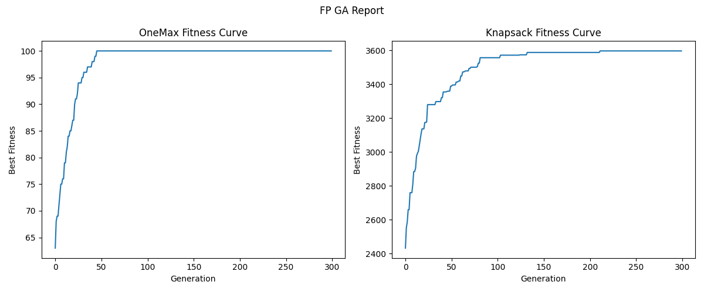

# Genetic Algorithm (GA) — OOP vs Functional Programming

## Student Information

* Name: Tran Quoc Huy
* Student ID: 2411283
* Course: Advanced Programming (CO2039)
* Assignment: Genetic Algorithm (GA) — Object-Oriented vs Functional Programming

---

## 1. Project Overview

This project implements the same Genetic Algorithm (GA) in two different programming paradigms:

* Object-Oriented Programming (OOP)
* Functional Programming (FP)

Both implementations solve two optimization problems:

* OneMax Problem
* 0/1 Knapsack Problem

The two versions use the same GA configuration so that their results can be compared fairly.

---

## 2. GA Configuration

| Parameter             | Value                       |
| --------------------- | --------------------------- |
| Representation        | Bitstring                   |
| Population size       | 100                         |
| Selection             | Tournament selection, k = 3 |
| Crossover             | One-point crossover         |
| Crossover probability | 0.9                         |
| Mutation              | Bit-flip mutation           |
| Mutation probability  | 1 / chromosome length       |
| Elitism               | 2 best individuals          |
| Generations           | 300                         |
| Random seed           | 42                          |

---

## 3. Project Structure

```text
ga-assignment/
│
├── README.md
│
├── oop/
│   ├── src/
│   │   ├── chromosome.py
│   │   ├── population.py
│   │   ├── selection_strategy.py
│   │   ├── crossover_strategy.py
│   │   ├── mutation_strategy.py
│   │   ├── fitness.py
│   │   ├── ga.py
│   │   └── utils.py
│   │
│   ├── tests/
│   └── run.py
│
├── fp/
│   ├── src/
│   │   ├── ga.py
│   │   ├── fitness.py
│   │   └── utils.py
│   │
│   ├── tests/
│   └── run.py
│
└── reports/
    ├── oop_curve.png
    ├── fp_curve.png
    ├── results_oop.json
    └── results_fp.json
```

---

## 4. OOP Implementation

The OOP version represents GA components using classes and objects.

Main components:

* `Chromosome`: represents a candidate solution
* `Population`: stores and manages chromosomes
* `SelectionStrategy`: abstract interface for selection
* `TournamentSelection`: tournament selection implementation
* `CrossoverStrategy`: abstract interface for crossover
* `OnePointCrossover`: one-point crossover implementation
* `MutationStrategy`: abstract interface for mutation
* `BitFlipMutation`: bit-flip mutation implementation
* `GeneticAlgorithm`: coordinates the GA process

This version emphasizes:

* encapsulation
* abstraction
* modularity
* extensibility

---

## 5. FP Implementation

The FP version implements the GA using functions and simple immutable-style data structures.

Main ideas:

* no classes
* chromosomes are represented as lists of bits
* population is represented as a list of chromosomes
* operators are implemented as standalone functions
* functions return new data instead of modifying objects directly

Main functions include:

* `create_population`
* `evaluate_population`
* `tournament_select`
* `one_point_crossover`
* `bit_flip_mutation`
* `next_generation`
* `run_ga`

This version emphasizes:

* pure-function style
* immutability
* function composition
* simple data flow

---

## 6. How to Run

### 6.1 Install Dependencies

```bash
pip install matplotlib
```

---

### 6.2 Run OOP Version

```bash
python oop/run.py
```

---

### 6.3 Run FP Version

```bash
python fp/run.py
```

---

## 7. Output Files

After running both versions, the following files are generated in `reports/`:

```text
reports/
├── oop_curve.png
├── fp_curve.png
├── results_oop.json
└── results_fp.json
```

### JSON Output

Each JSON file contains:

* best fitness
* best genes
* fitness history over generations
* runtime

for both OneMax and Knapsack.

---

## 8. Visualization

### OOP Result


---

### FP Result



---

## 9. Testing

Minimal unit tests are designed to cover:

* fitness evaluation
* selection
* crossover
* mutation
* improvement over generations

---

## 10. Result Summary

Both implementations successfully solve the required problems.

For OneMax, the GA is expected to converge to the maximum fitness value of 100.

For Knapsack, the GA improves the best fitness over generations while respecting the capacity constraint.

The generated curves show the fitness evolution during the optimization process.

---

## 11. Reflection

The OOP implementation is more structured and easier to extend because each GA component is separated into a class or strategy. This makes the design clearer when adding new selection, crossover, or mutation methods. However, it requires more files and more boilerplate code.

The FP implementation is shorter and has a simpler data flow. Since the logic is expressed through functions, it is easier to trace how data moves through the algorithm. However, for a larger system, the lack of object boundaries may make the design harder to organize.

Overall, both paradigms can implement the same GA correctly. OOP is better for extensibility and modular design, while FP is better for concise logic and functional composition.

---

